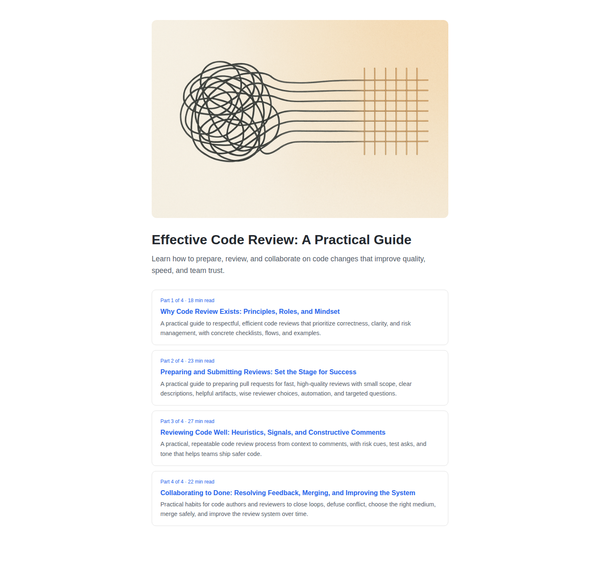

# course-forge

Turn a topic into a fully drafted, illustrated, QA-checked online course.

```
storyboard → draft → author → illustrate → QA review → bundle
```

1. **Storyboard** — an LLM plans the course: title, subtitle, and a per-lesson outline
   (objective, key points, read time, hero/figure image concepts).
2. **Draft** — expands each lesson into full long-form prose.
3. **Author** — cleans the draft into safe HTML, writes alt text/captions, computes read time.
4. **Illustrate** — generates the course hero, every lesson hero, and every inline figure with
   OpenAI's `gpt-image-1`, in a configurable visual style, and splices the images into the body.
5. **QA review** — checks the result three ways:
   - **Structural**: sanitizer/leftover-token/missing-alt-text checks. No LLM call.
   - **Content**: a vision model judges the lesson text and its images together — do they match,
     is the prose coherent.
   - **Rendered page**: the course is rendered to real HTML and screenshotted with Playwright.
     The DOM is checked for overflow/clipping, and a vision model looks at the full-page
     screenshot for anything cut off, truncated, or overlapping.

   Lessons that fail get redrafted/re-illustrated automatically (up to 2 retries) before being
   left for you to review.
6. **Bundle** — the finished course as a self-contained folder: `manifest.json`, `index.html`,
   one `lesson-<slug>.html` per lesson, and an `images/` folder. No database, no CMS coupling —
   drop it into whatever you're building, or serve it as-is.

## Example

[`examples/sample-course`](examples/sample-course) is a real, unedited 4-lesson course generated
by `course-forge run "Effective Code Review: A Practical Guide" --lessons=4` — this is exactly
what a `run` produces and exactly what passed QA, nothing touched up by hand.



Open [`examples/sample-course/index.html`](examples/sample-course/index.html) directly in a
browser (it's plain static HTML, no server needed), or clone the repo and run:

```
course-forge preview examples/sample-course
```

## Install

```
npm install -g course-forge
npx playwright install chromium   # one-time, needed for the QA render-check
export OPENAI_API_KEY=sk-...
```

(Local dev: `npm install` then `node bin/run.js ...` instead of the global `course-forge` command.)

## Usage

```
course-forge run "A practical guide to prompt injection defense" --lessons=8
```

This writes `output/a-practical-guide-to-prompt-injection-defense/` and prints its path once QA
passes. Preview it anytime with:

```
course-forge preview output/a-practical-guide-to-prompt-injection-defense
```

### Flags

| Flag | Default | What it does |
|---|---|---|
| `--lessons=N` | `8` | Number of lessons to storyboard. |
| `--course-id=slug` | slugified topic | Override the course id/output folder name. |
| `--out=dir` | `./output` | Where finished course bundles are written. |
| `--config=path` | `./course-forge.config.json` if present | Voice, image style, models — see below. |
| `--force-images` | off | Regenerate images even if a stable file already exists. |
| `--sqlite=path` | off | Also export the course into a generic SQLite `courses`/`lessons` schema. |
| `--base-url=URL` | off (uses a built-in local preview server) | Check an already-hosted copy of the bundle instead of spinning up a local one — use this if you've copied the bundle onto your own site and want QA to check the real thing. |

### Config file

Copy `course-forge.config.example.json` to `course-forge.config.json` and adjust:

```json
{
  "voice": "Clear, calm, precise, and engaging instructional voice...",
  "imageStyle": "Clean, professional editorial illustration...",
  "textModel": "gpt-5",
  "imageModel": "gpt-image-1",
  "brandColor": "#2563eb"
}
```

- `voice` — the system prompt steering every text-generation call (storyboard, draft, author).
  This is the main lever for making generated courses sound like *your* courses.
- `imageStyle` — appended to every image prompt, so all generated art shares one visual style.
- `brandColor` — the one accent color used in the bundle's HTML template.

No config file is required — sensible generic defaults are built in.

## Resuming

Every stage's intermediate output is cached under `<outDir>/.work/<course-id>/` (storyboard,
per-lesson drafts, authored JSON, screenshots, QA report). Re-running the same `--course-id`
resumes: any stage whose output already exists is skipped rather than re-calling the LLM. Use
`--force-images` to regenerate images specifically (e.g. after tweaking `imageStyle`).

## If QA fails

The run exits non-zero, and the bundle plus everything QA saw is left on disk for you to
inspect:

- `<outDir>/.work/<course-id>/qa-report.json` — structural/content/render findings per lesson.
- `<outDir>/.work/<course-id>/screenshots/*.png` — exactly what Playwright saw for the course
  index page and every lesson page.

To retry, just re-run the same command — it resumes from the cache, so passing lessons aren't
regenerated.

## SQLite export

`--sqlite=./output/course.db` writes the same course into a generic two-table schema
(`courses`, `lessons`) via `better-sqlite3`, for anyone who wants a ready-made DB instead of raw
files. `better-sqlite3` is an optional dependency — install it (`npm install better-sqlite3`) only
if you use this flag; a plain file-bundle run never needs native compilation.

## Programmatic use

Every stage is a plain exported function (`src/stages/*.js`), so you can call `runPipeline()`
from `src/run.js` directly, or wire individual stages into your own tool instead of using the CLI.

## License

MIT
